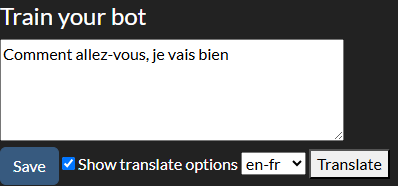
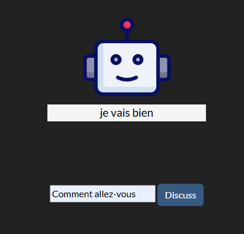
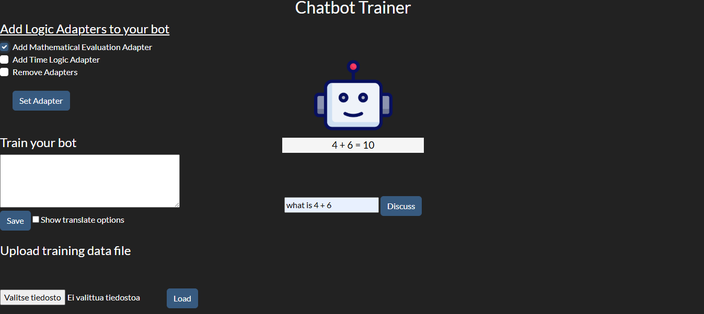

Project keywords: Python Django, Machine Learning, Chatterbot, File-Handling

This application provides a HTML front-end with Django backend for training a Python Chatterbot. The user can input training data to the chatbot by typing it into a textarea element or from a pre-built text file.

READING DATA FROM A TEXT FILE

The HTML UI has a file selector that uploads the selected file to the root folder of the application. The file contents are then looped over using a for loop and stored in a Python list. The list is passed as a parameter to the chatterbot's ListTrainer class.

READING DATA FROM A PDF FILE

PDF files are read using the PyPDF library. After reading the PDF file, the file data is processed in the same way as in the text file option.

TRANSLATE USER-ENTERED TRAINING DATA INTO ANOTHER LANGUAGE

For example, a user can create a chatbot that speaks Spanish, even if the user does not know how to write Spanish. The application uses the LibreTranslate API to translate training data from the original language to the desired language. The translation is done using a JavaScript function that sends the original text to the LibreTranslate API using the Fetch method and ultimately receives the translated result. The translated result is placed in a textarea element, which the user can send to the chatterbot as training material by clicking the button element.

Currently, text translation works from English to 46 different languages. Language pairs are automatically retrieved from the LibreTranslate API's /languages ​​endpoint using the JavaScript Fetch method and added to the HTML selector component using a ForEach loop.

Example image where a user has translated the English sentences "How are you" and "I'm fine" into French.

The sentences are then given to the chatbot as training data. The following image shows that the chatbot is able to respond using the training data entered in French when the question is asked in French.

TRANSLATING TRAINING DATA FILE INTO ANOTHER LANGUAGE

The text content of the files can also be translated into the desired language and fed to the chatbot as training data. For now, this feature only works with .txt files. To rewrite a text file in another language, the application uses the JavaScript FileSaver library. (https://github.com/eligrey/FileSaver.js)

USING LOGIC ADAPTERS

The application also allows you to simply chat with the chatbot. If desired, the user can choose which logic adapters they want to use to help with the conversation. The logic adapters are listed on the html page and can be selected by clicking on the checkbox element of the desired adapter.

Example image where the user has selected the Mathematical Evaluation Adapter and asks the bot for the result of a simple addition calculation.

